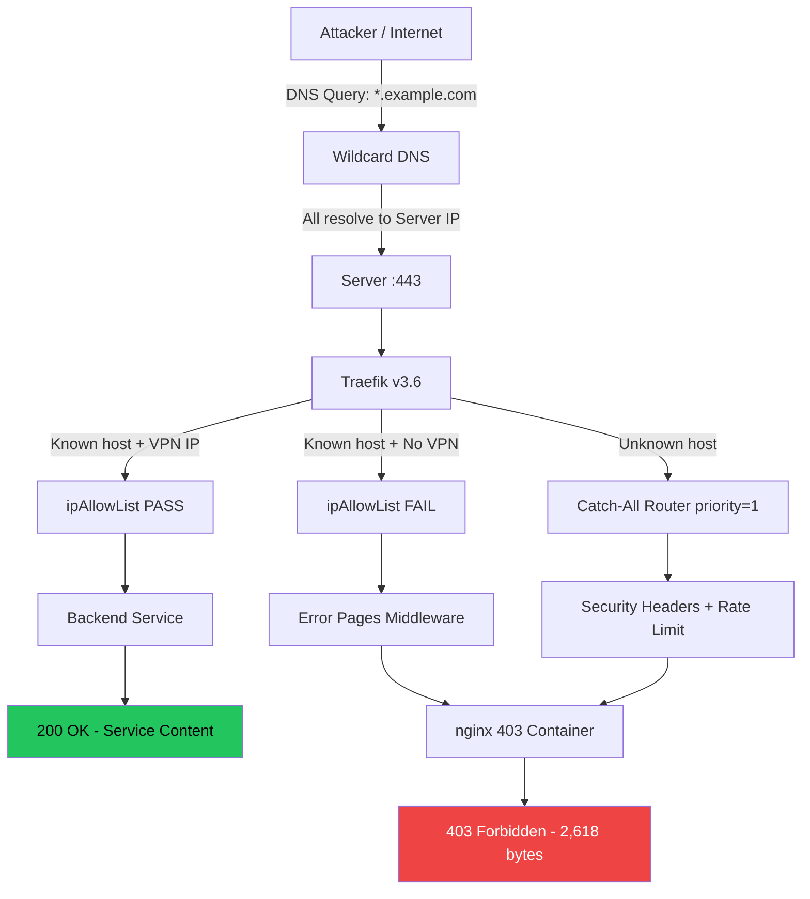

# Architecture

Technical deep-dive into Ghostructure's anti-enumeration infrastructure.

---

## Network Flow



## Traefik Routing Logic

Traefik evaluates routers by **priority**. Higher priority routers are evaluated first. The routing order is:

### Priority Order

| Priority | Router | Rule | Result |
|---|---|---|---|
| Highest | Service-specific routers | `Host(\`service.example.com\`)` | Matched first if host is known |
| Lowest (1) | `catch-all@file` | `HostRegexp(\`.+\`)` | Matches everything else |

### What Happens for Each Request Type

**1. Unknown subdomain (e.g., `fake.example.com`)**

```
Request → Traefik → No specific router matches
                  → catch-all@file (priority 1) matches
                  → securityHeaders middleware
                  → catchall-ratelimit middleware (5 req/s)
                  → nginx-403 service
                  → 403 Forbidden (2,618 bytes)
```

**2. Known subdomain, no VPN (e.g., `service.example.com` from public IP)**

```
Request → Traefik → service@docker router matches
                  → vpnOnly@file middleware (ipAllowList)
                  → Source IP not in 100.64.0.0/10
                  → 403 Forbidden from Traefik
                  → error-pages@docker middleware intercepts 403
                  → nginx-403 service
                  → 403 Forbidden (2,618 bytes)
```

**3. Known subdomain, with VPN (e.g., `service.example.com` from NetBird IP)**

```
Request → Traefik → service@docker router matches
                  → vpnOnly@file middleware (ipAllowList)
                  → Source IP in 100.64.0.0/10 ✓
                  → Backend service container
                  → 200 OK (service content)
```

The critical point: scenarios 1 and 2 produce **byte-for-byte identical responses** because they both terminate at the same nginx container serving the same static HTML file.

## DNS-01 Challenge Automation

Wildcard certificates cannot use HTTP-01 challenges (which require per-subdomain validation). DNS-01 challenges work by:

1. Traefik requests a wildcard certificate from Let's Encrypt
2. Let's Encrypt asks Traefik to prove domain ownership by creating a DNS TXT record
3. Traefik uses the DNS provider API to automatically create the `_acme-challenge.example.com` TXT record
4. Let's Encrypt verifies the TXT record and issues the wildcard certificate
5. Traefik stores the certificate and uses it for all `*.example.com` requests

### Traefik ACME Configuration

```yaml
# traefik.yml (static config)
certificatesResolvers:
  letsencrypt:
    acme:
      email: admin@example.com
      storage: /certs/acme.json
      dnsChallenge:
        provider: your-dns-provider
        resolvers:
          - "1.1.1.1:53"
          - "8.8.8.8:53"
```

Required environment variables:

```
DNS_PROVIDER_API_KEY=your-api-key
DNS_PROVIDER_API_SECRET=your-api-secret
```

## VPN Integration with Traefik ipAllowList

NetBird creates a WireGuard mesh VPN with peers in the `100.64.0.0/10` CIDR range. Traefik's `ipAllowList` middleware restricts access to services based on source IP:

```yaml
# dynamic config
http:
  middlewares:
    vpnOnly:
      ipAllowList:
        sourceRange:
          - "100.64.0.0/10"    # NetBird VPN peers
          - "127.0.0.1/32"     # Localhost
          - "172.18.0.0/16"    # Docker proxy network
          - "172.19.0.0/16"    # Docker backend network
```

When a request arrives from an IP outside these ranges, Traefik returns a 403. The error-pages middleware catches this 403 and serves the nginx static page — making it indistinguishable from the catch-all response.

## Docker Network Topology

```
┌─────────────────────────────────────────────────────────┐
│                     Host Machine                         │
│                                                          │
│  ┌─────────────────────────────────────────────────┐    │
│  │          proxy network (172.18.0.0/16)           │    │
│  │                                                   │    │
│  │  ┌─────────┐  ┌──────────┐  ┌───────────────┐   │    │
│  │  │ Traefik │  │ nginx-403│  │ NetBird Server│   │    │
│  │  │ :80/:443│  │ (catch-  │  │ (VPN mgmt +   │   │    │
│  │  │         │  │  all)    │  │  dashboard)   │   │    │
│  │  └─────────┘  └──────────┘  └───────────────┘   │    │
│  └─────────────────────────────────────────────────┘    │
│                                                          │
│  ┌─────────────────────────────────────────────────┐    │
│  │         backend network (172.19.0.0/16)          │    │
│  │                                                   │    │
│  │  ┌─────────┐  ┌──────────┐  ┌───────────────┐   │    │
│  │  │ Traefik │  │ App      │  │ Database      │   │    │
│  │  │ (also   │  │ Services │  │ (PostgreSQL,  │   │    │
│  │  │  here)  │  │          │  │  Redis, etc.) │   │    │
│  │  └─────────┘  └──────────┘  └───────────────┘   │    │
│  └─────────────────────────────────────────────────┘    │
│                                                          │
│  ┌─────────────────┐                                    │
│  │ WireGuard (wt0) │ ← NetBird VPN overlay              │
│  │ 100.64.0.0/10   │   Encrypted mesh tunnel             │
│  └─────────────────┘                                    │
└─────────────────────────────────────────────────────────┘
```

### Network Isolation

- **proxy network**: Public-facing containers that need Traefik routing (reverse proxy, error pages, VPN management)
- **backend network**: Internal services and databases, no direct public access
- **Traefik bridges both networks**: It connects to both proxy and backend, routing requests to the appropriate container
- **WireGuard overlay**: VPN peers connect through the encrypted tunnel, their traffic arrives at Traefik with source IPs in the `100.64.0.0/10` range

## Rate Limiting Architecture

```
                    Incoming Request
                          │
                    ┌─────┴─────┐
                    │  Traefik  │
                    └─────┬─────┘
                          │
              ┌───────────┼───────────┐
              ▼           ▼           ▼
         Catch-All    VPN-Blocked   VPN Dashboard
              │           │           │
     catchall-ratelimit   │     vpn-ratelimit
       (5 req/s)     No extra      (10 req/s)
              │       rate limit        │
     securityHeaders  │          vpn-headers
              │      securityHeaders     │
              ▼           ▼              ▼
           nginx-403   nginx-403    Dashboard
           (2,618B)    (2,618B)     (content)
```

### fail2ban Integration

Traefik writes JSON access logs to `/var/log/traefik/access.log`. Two fail2ban jails monitor these logs:

| Jail | Trigger | Action |
|---|---|---|
| `traefik-enum` | 50 catch-all hits in 60 seconds | Ban IP for 1 hour (iptables) |
| `traefik-vpn` | 20 failed requests to VPN dashboard in 60 seconds | Ban IP for 1 hour (iptables) |

This means an attacker attempting rapid subdomain enumeration will be automatically banned at the firewall level after ~50 requests, well before they can complete a meaningful scan.
